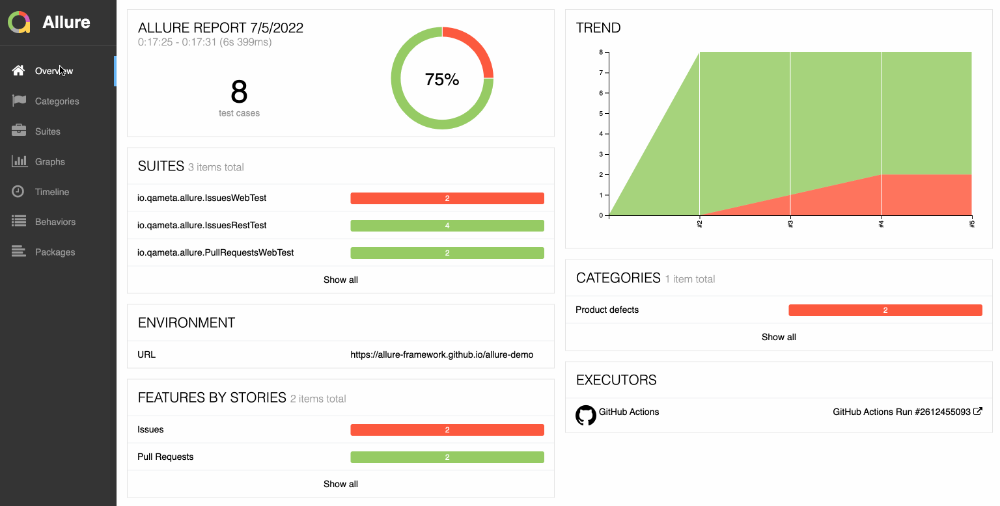

# my-allure-report

## react@17.0.2 + react-dom@17.0.2 + react-router@6.2.1 + redux + redux-thunk + less + echarts

- Allure官方仓库：https://github.com/allure-framework/allure2
- 这个一个模仿Allure report的自动化测试报告前端页面，用来学习使用react，redux
- 适配了pc端和移动端

